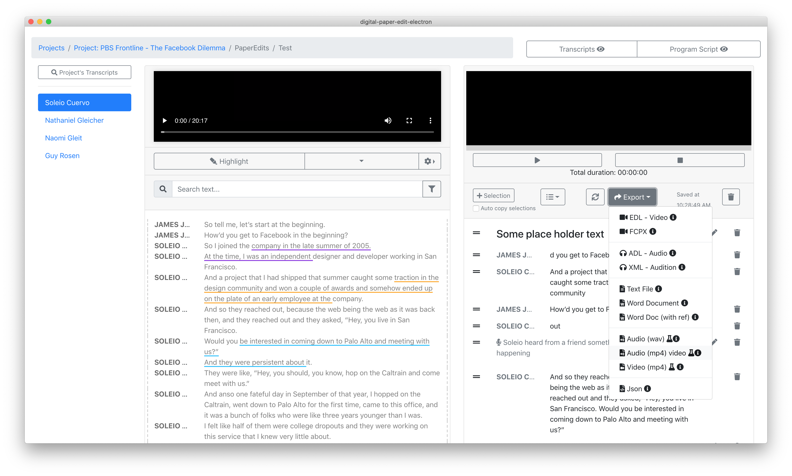

# Export \(options\)

Once you have [created a programme script ](../paperediting/create-a-new-paper-edit.md)there are a few ways to export it. 

see below for [export options](./#export-options)

## Export options

#### EDL - Video

Export en EDL, edit decision list, to import the programme script as a sequence in video editing software - Avid, Premiere, Davinci Resolve, for FCPX choose FCPX XML.


[Check out this section on how to open an EDL](opening-edl-in-video-editing-software/) in a video editing software of choice to get a video sequence of your selections.


#### ADL - Audio

Export an ADL, audio decision list, to import the programme script as a sequence in audio editing software such as SADiE.

#### FCPX

Export Final Cut Pro X, XML, to import the programme script as a sequence in Final Cut Pro X, video editing software

#### Text File

Export the programme script as a text version. This also contains speaker labels, and timecode and the clip file name for each transcript's text selection.

#### Word Document

Export the programme script as a word document

#### Word Doc \(with ref\)

Export the programme script as a word document with timecode and file reference information for each transcript's text selection.

#### Audio or Video **- Experimental** [🧪](https://emojipedia.org/test-tube/)

Experimental feature, that allows you to export an audio or video preview of your paper edit's programme script. [See here for more details.](export-a-video-or-audio-preview.md)  
  
You can also [export audio as video with an animated  waveform](export-a-video-or-audio-preview.md#export-audio-as-video-with-animated-waveform).

#### Json

Export the programme script as a json file. Mostly an option for developers

