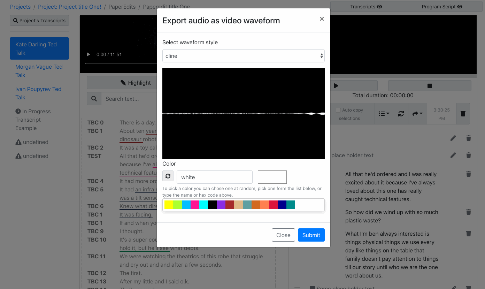

# Export an video or audio preview

You can export a video or audio preview of your paper edit's programme script. 

The preview is most likely going to be lower resolution than your original media. 


The idea is that if you are collaborating with an exec or editor you could export a word doc version of it, as well as the audio or video preview and share that with them to make collaboration and feedback easier.  
  
Eg add the word doc to google docs, and the audio or video file to [dropbox to make use of those platform commenting features](https://help.dropbox.com/files-folders/share/comment-timestamp).


### Export audio as video with animated waveform

You can also export audio as video with an animated  waveform, choose a waveform style and color. 

Color can be any valid [css color name](http://w3schools.sinsixx.com/css/css_colornames.asp.htm) or valid [hex value](https://www.color-hex.com/).

Here's some example of the available waveforms styles 

#### Cline

#### Line

#### p2p

#### Point 

### Adding captions

To add captions to the automated waveform, at the moment, the exported mp4 could be combined with captions, by [exporting plain text option from this app](./#text-file), and using [subtitlesComposer-app](https://autoedit.gitbook.io/subtitles-composer-app/) to create a caption file.

Then you could then either use an editing software of choice to bring the two together, or the experimental [captions burner app](https://pietropassarelli.com/captions_burner/).

#### 

