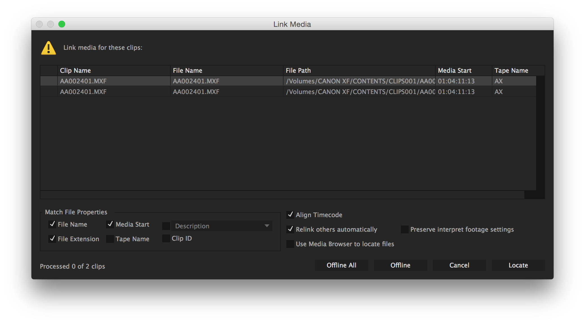

# Adobe Premiere

## Adobe Premiere example 

See below for a walk through of how to import an EDL in premiere.

[Fore more details see the official docs](https://helpx.adobe.com/premiere-pro/using/importing-sequences-clip-lists-libraries.html).

## Align timecode in Premiere

In adobe premiere there is an option to `align timecode`The Align Timecode option is also checked by default to align the media file's source timecode to the clip being linked.

From __[_Relink offline media_ adobe website](https://helpx.adobe.com/premiere-pro/using/relinking-media.html)

This option can be useful if you imported in autoEdit footage directly from a camcorder that might have camera time codes offsets \(eg rec run, time of the day, free run etc..\) as autoEdit would read the metadata of the file and calculate the offset for you automatically.

