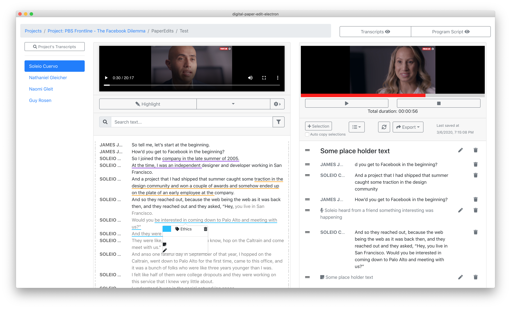
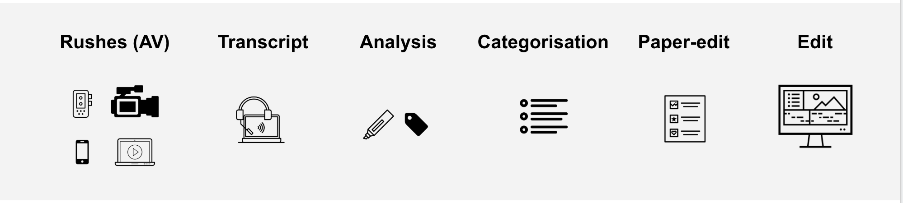

# Introduction


If this is your first time using this app, see the [installation](installing/) and [setup instructions](setup.md) to [setup the STT API system first](speech-to-text/), and [download the latest release](installing/).


If you don't have experience editing audio/video interviews or would like a refresher on the most effective process, you might want to check out this other gitbook ["How to tell compelling stories out of video interviews"](https://pietropassarelli.gitbooks.io/how-to-tell-compelling-stories-out-of-video-inter/content/).

Or checkout the these [overview slides](https://docs.google.com/presentation/d/1ns0HZNnhTb3pI7S_634Shk-4ThgPS68jiylFWkaldkk/edit?usp=sharing).


This app is in active development. It is an [open source project](https://github.com/pietrop/digital-paper-edit-electron). It’s [first version](https://pietropassarelli.com/autoEdit.html) was a rough and ready working proof  of concept, the second version \([autoEdit2](https://github.com/OpenNewsLabs/autoEdit_2)\) was originally created as part of a [Knight-Mozilla fellowship](https://opennews.org/what/fellowships/) by [Pietro Passarelli](http://pietropassarelli.com/) with the [Vox Media product team](https://product.voxmedia.com/2016/11/22/13669486/faster-video-editing). This last version was initially started as one of the [BBC News Labs](https://bbcnewslabs.co.uk/projects/digital-paper-edit) open source projects \([Digital Paper Edit](https://github.com/bbc/digital-paper-edit)\). 

The current version has been renamed to[ autoEdit 3](www.autoEdit.io) extending [autoEdit 2](https://github.com/OpenNewsLabs/autoEdit_2) and digital paper edit[ philosophy, features and functionalities](https://source.opennews.org/articles/video-editing-made-better-introducing-autoedit/) further.



You can [contribute](support-the-project.md) and/or [propose ideas](mailto:pietro@autoEdit.io?Subject=autoEdit%202%20question) you have for this project.

[autoEdit.io](http://www.autoedit.io/) is free and open source. [Free as in free speech as well as in free beer](https://en.wikipedia.org/wiki/Gratis_versus_libre).


