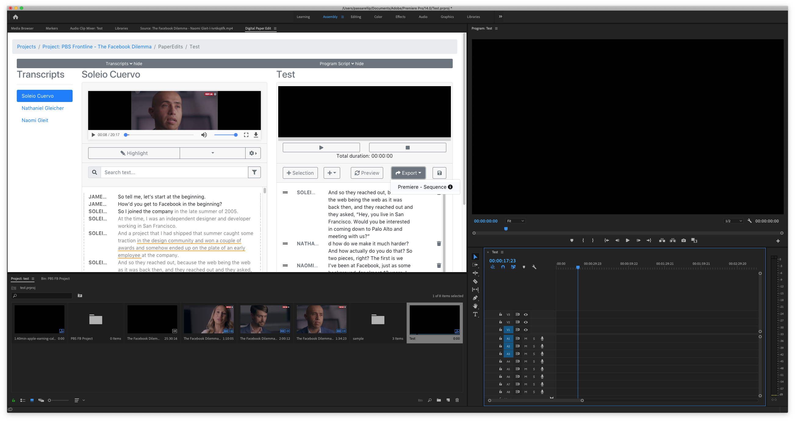
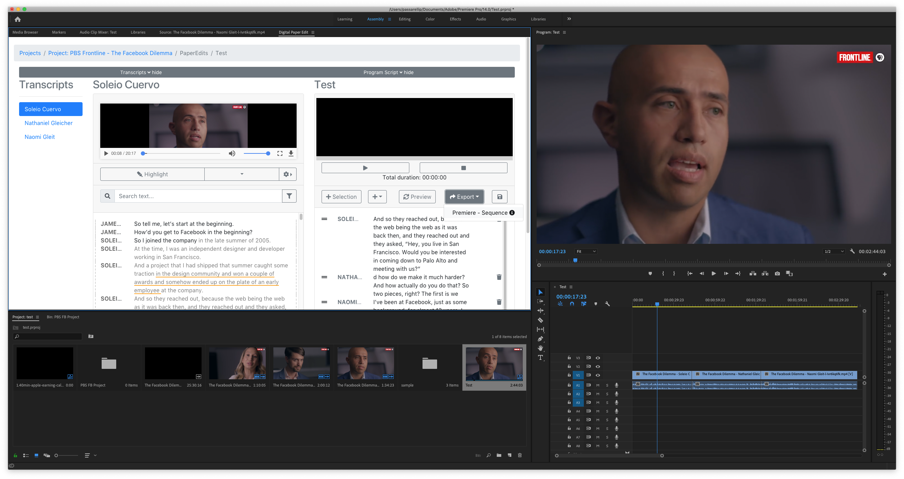

# Paper-edit to sequence


Work in progress


To export a programme script/paper edit into a premiere sequence

1. click export 'Premiere Sequence' 
2. It will ask 'Do you want to create a new sequence?'  - yes or no 

