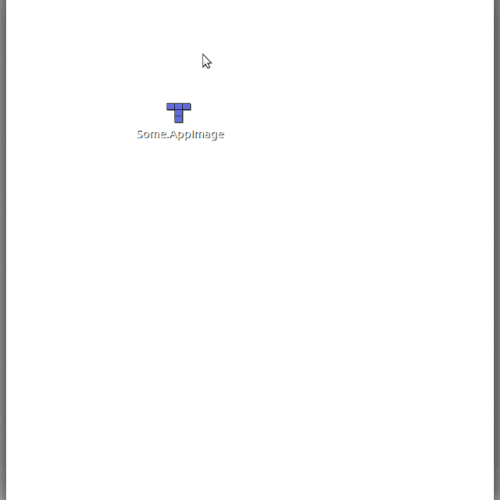

# Installing on Linux


Download the latest stable release from the [releases page](https://github.com/pietrop/digital-paper-edit-electron/releases). Check out the release description to see what has changed from the previous version.


* For linux download the `.AppImage` file

## Option 1

[From `AppImage` documentation](https://discourse.appimage.org/t/how-to-make-an-appimage-executable/80):

1. Open your file manager and browse to the location of the AppImage
2. Right-click on the AppImage and click the ‘Properties’ entry
3. Switch to the Permissions tab and
4. Click the ‘Allow executing file as program’ checkbox if you are using a Nautilus-based file manager \(Files, Nemo, Caja\), or click the ‘Is executable’ checkbox if you are using Dolphin, or change the ‘Execute’ drop down list to ‘Anyone’ if you are using PCManFM
5. Close the dialog
6. Double-click on the AppImage file to run

See example below:

## Option 2, using terminal

* Navigate to that folder in terminal and make it executable `chmod a+x {exampleName}.AppImage` Where exampleName is the name of the app. 
* You can then launch the app from terminal `./exampleName.AppImage`.
* Subsequent times you can just double click the app image icon.

\_\_

