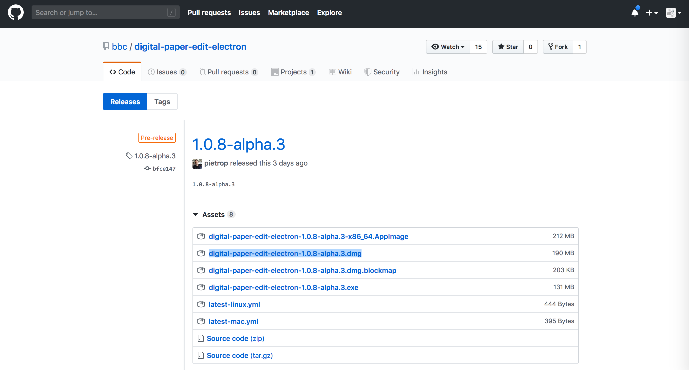
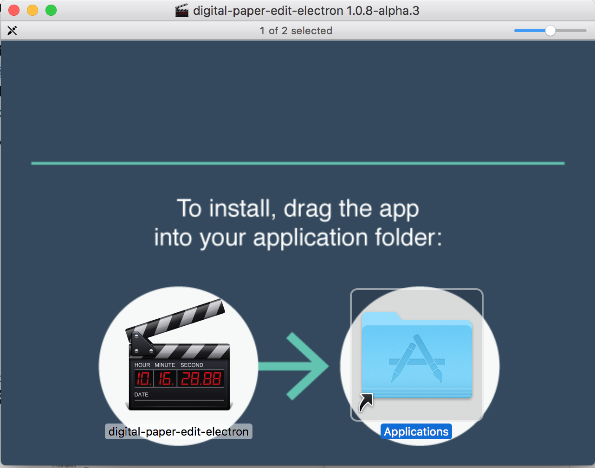

# Installing on Mac OSX

## Download 


Download the latest stable release from the [releases page](https://github.com/pietrop/digital-paper-edit-electron/releases). Check out the release description to see what has changed from the previous version.


* Click a**`ssets`** on the version you would like \(the newest one is at the top\)
* Click the `digital-paper-edit-electron-<version>.dmg` to download the `dmg` file. 
* Once downloaded, double click and open the `dmg` file
* Drag the app into the applications folder

* Add it to the dock if you want a shortcut to it.


First time opening the app, right click on the app and click open.   
From then on you can just double click.


## `unidentified developer`error

if you get the`unidentified developer`error follow [these instructions](https://support.apple.com/kb/PH25088) or rick click onto the app and click open.


See [initial setup](../setup.md) for getting started


