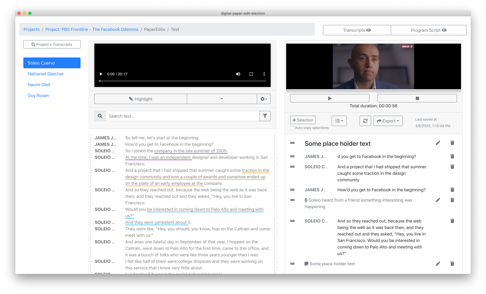
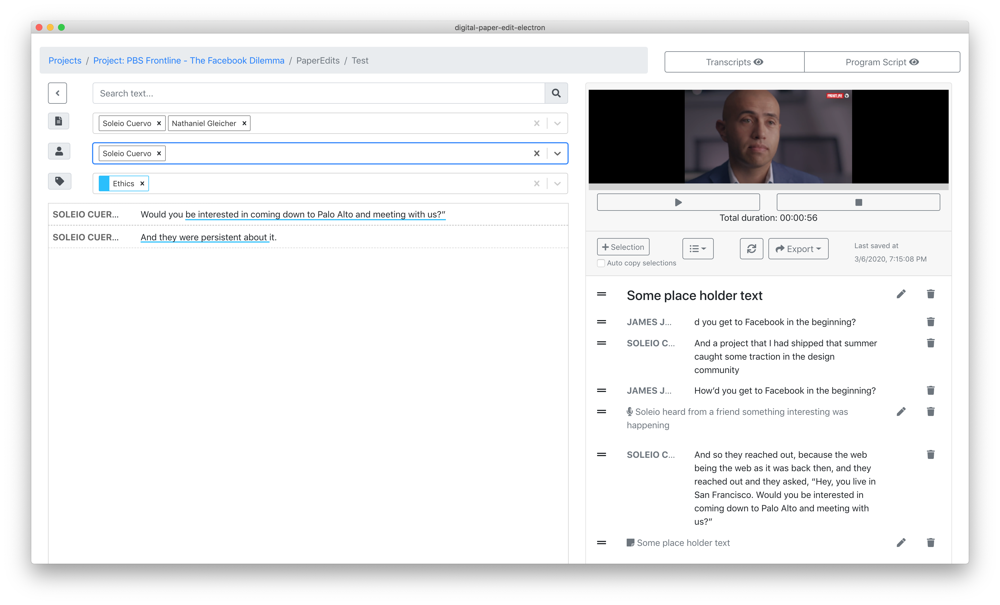

# Search across transcripts in a project

Click on the search button above the list individual transcripts to access this feature.

You can then choose   
1. which transcripts you'd want to include in the search   
2. text search   
3. filter by speaker  
4. filter by labels 

To close this search view click on the left arrow on the top left.

