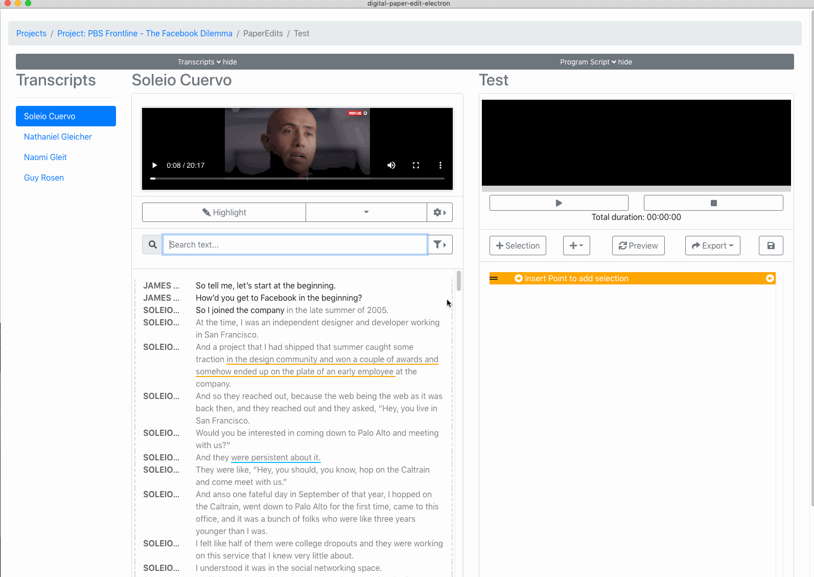

# 2. Select text from transcriptions


Note that as of this version, the programme script paper edit, does not auto save make sure to click the save button often as you change your work \(just in case\)


