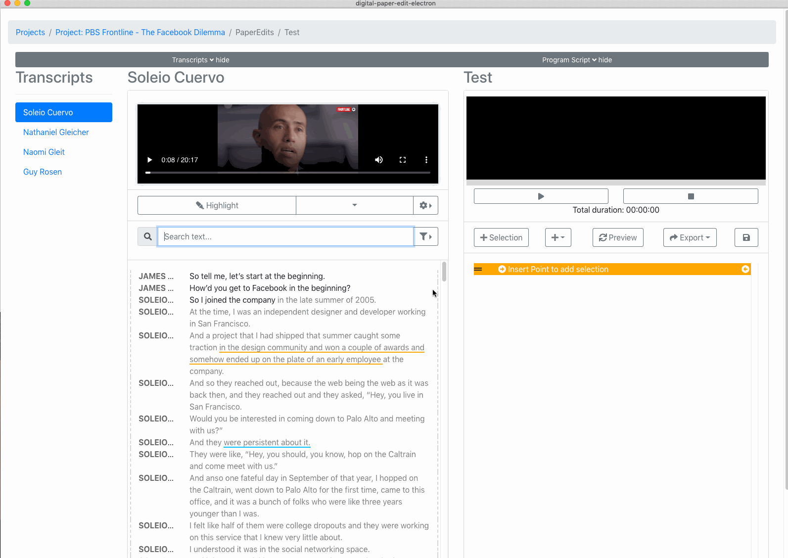

# 2. Select text from transcriptions


as of version 1.0.6 the programme script auto saves, and save button as been removed.


There are 3 way to select from a transcript and copy it across to the programme script

## 1. Using the "+ Selection" button

1. select text in transcript
2. click "+ Selection" button
3. The text selection will be added above the orange insert point 

[See here for two ways for moving the orange insert point](move-insert-point.md).

## 2. "Copy / paste"

You can select text in a transcript, and use the contextual menu in the programme script to paste the selection.

## 3. Advanced - select + auto "copy/paste"

There is an advanced option to select text in a transcript and have it "auto copy /paste"  in the programme script at the position of the orange insert point.  
  
To enable this click the check box next to  "+ Selection" button.

This feature is for advanced users for a faster workflow.

