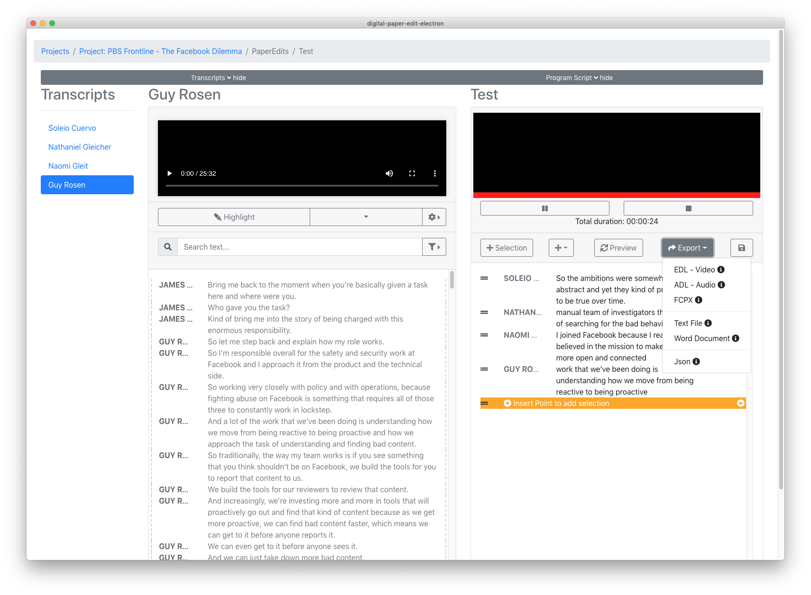

# 9. Export

## Export options

#### EDL - Video

Export en EDL, edit decision list, to import the programme script as a sequence in video editing software - Avid, Premiere, Davinci Resolve, for FCPX choose FCPX XML.


[Check out this section on how to open an EDL](../opening-edl-in-video-editing-software/) in a video editing software of choice to get a video sequence of your selections.


#### ADL - Audio

Export an ADL, audio decision list, to import the programme script as a sequence in audio editing software such as SADiE.

#### FCPX

Export Final Cut Pro X, XML, to import the programme script as a sequence in Final Cut Pro X, video editing software

#### Text File

Export the programme script as a text version

#### Word Document

Export the programme script as a word document

#### Json

Export the programme script as a json file. Mostly an option for developers

