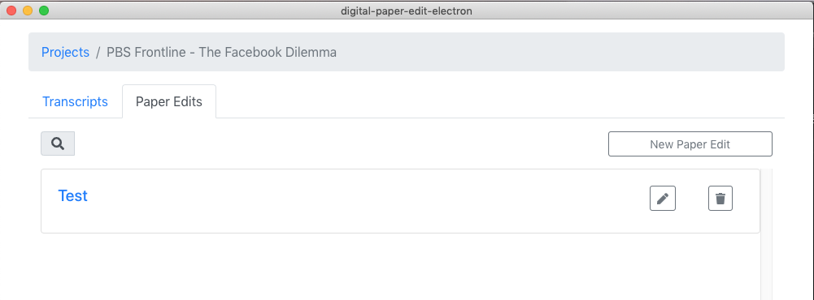
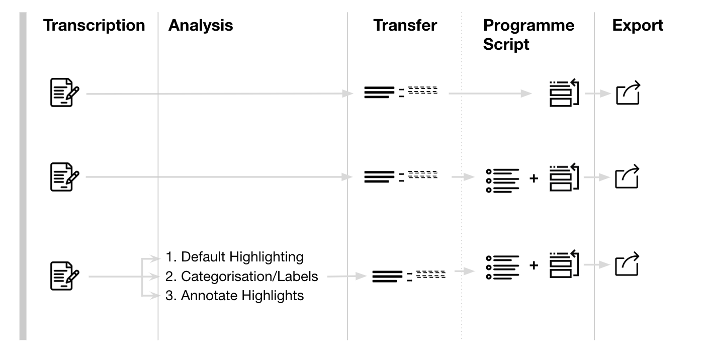

# Paperediting


If it is your first time using the tool go ahead and [do the initial setup first](../setup.md). Then [add some videos or audio files to transcribe](../transcriptions/create-a-new-transcription/), these can then be used in the paper-edit


## What is a paper-edit?

In this app you can pull selections from various transcriptions, organize them into a story, and when you are done export that as a video sequence. Through an EDL file, edit decision list, that can be opened with your video editing software of choice to continue editing your video.

If you want to know more about what is paper-editing, and why should you bother, check out this other gitbook ["How to tell compelling stories out of video interviews"](https://pietropassarelli.gitbooks.io/how-to-tell-compelling-stories-out-of-video-inter/content/). It is based on a workshop "_How to craft compelling stories out of video interviews?_" that focussed on the underlying evergreen storytelling principles that transcend the medium, introducing paper-editing in it's traditional paper, scissors and tape as a key story crafting technique to gain insight into the process of interviewed based documentary production.

## Viewing paper-edits

In  project clicking the paper edits tab will take you to the paper edit view.

## Overview

Once you have a transcript you can create a program script \(paper edit\). Int he program script / paper edit view you can:

* access project's transcripts
* highlight and annotate
* create custom labels
* search and filter \( at the moment with a transcript but in the future across transcripts in a project\)
* Create and preview a program script from transcript's text selections

### Workflow optional parts

The workflow can scale up or down depending on the complexity of the project you are working on.

