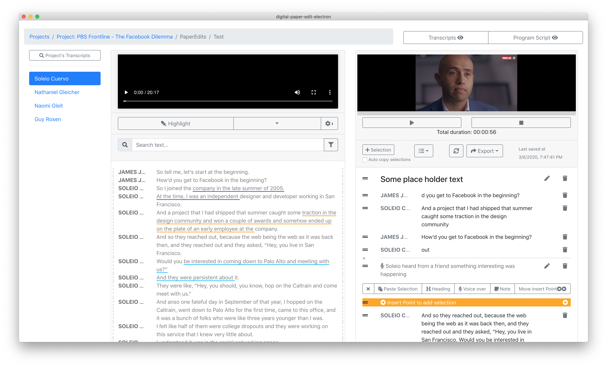

# Add headings to your story

Two ways to add headings to your story 

And in the same way you can also add **voice over** and **notes** elements.

* **voice over** placeholder text, for a voice over script that you can recorder later
* and **notes** to yourself  and others about the script 

## 1. Using dropdown menu

## 2. Using contextual menu

Click on the grey line that shows when you hover between sections of the programme script to trigger the contextual menu. then choose what you'd like to add.

