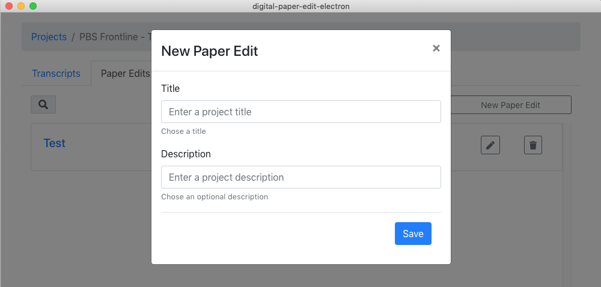
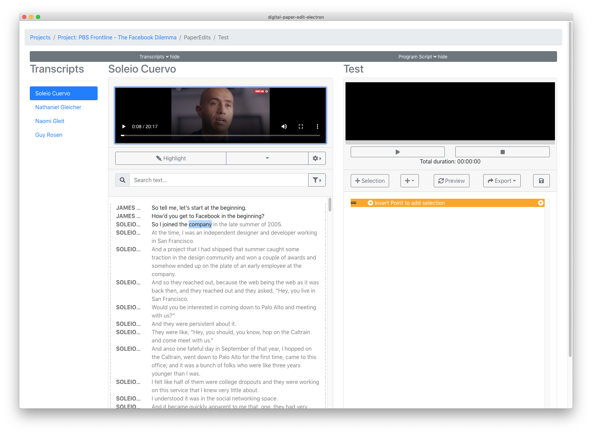

# 1. Create a new paper edit


If first time using the tool go ahead and [do the initial setup first](../setup.md). Then [add some videos or audio files to transcribe](../transcriptions/create-a-new-transcription.md), these can then be used in the paper-edit


## 1. Create a new paper-edit 

## Paper edit workspace overview

In this paper edit workspace, you have 3 columns.

1. list of transcripts for the project
2. the current selected transcript
3. A "programme script work pad" where you can bring in selections from the transcripts, and auto generate a preview, before exporting.

