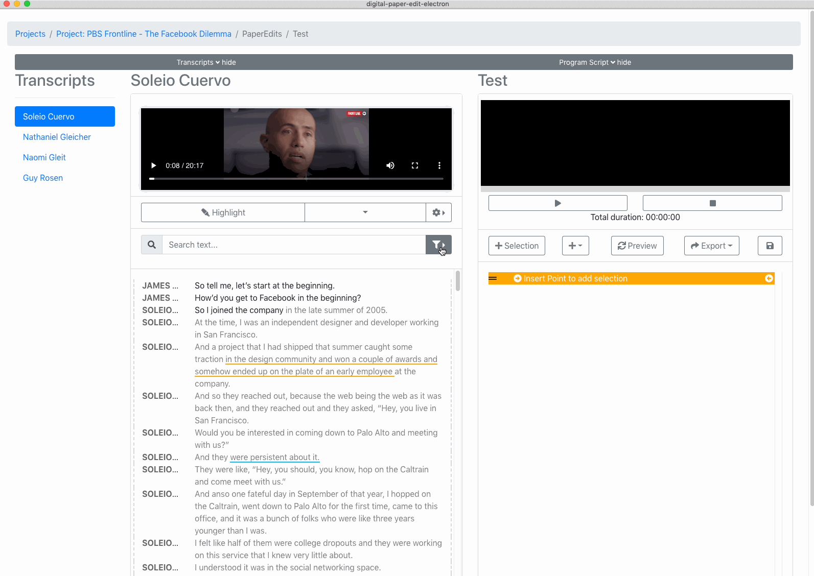

# Search

You can 

* full text search 
* filter by speaker
* filter by tag/label 
* See only matching paragraphs, or the results in context


In the current release you can only search within one transcription. In future releases ideally you'd be able to have the option to search across all the transcript belonging to the same project.


