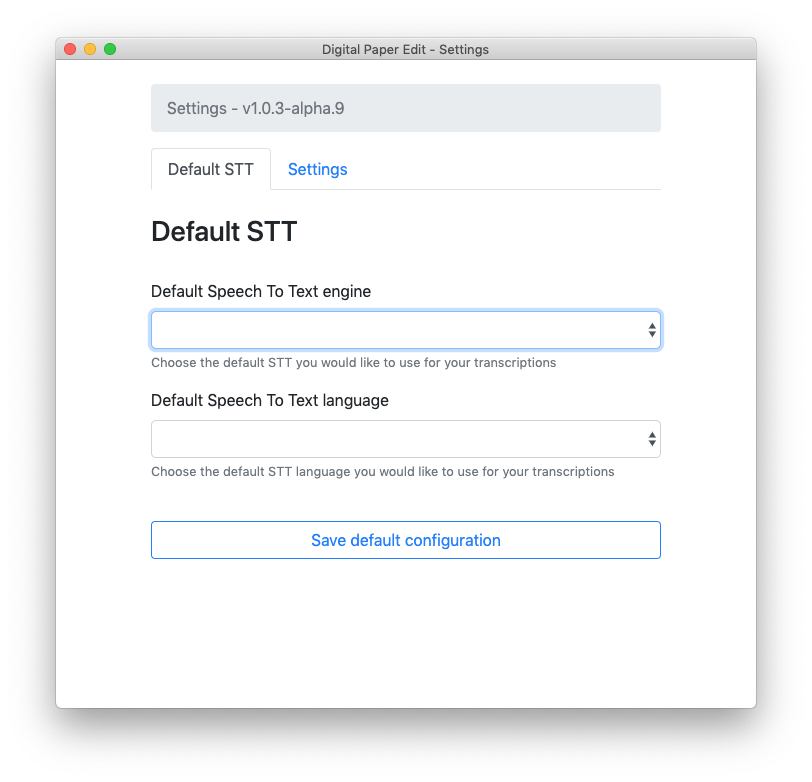
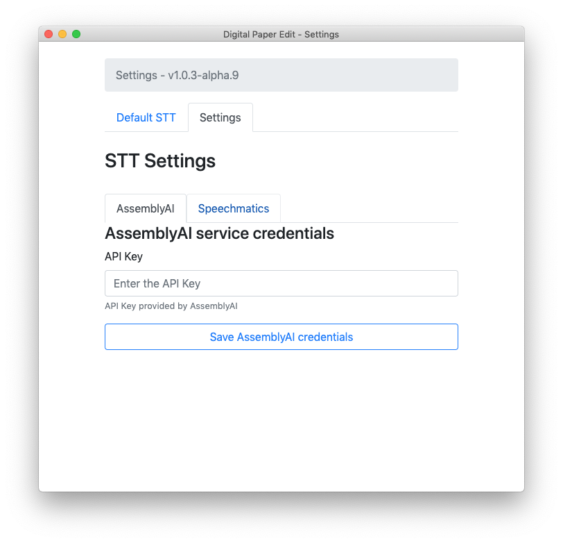

# Initial Setup

This setup is common to all Speech To Text options

1.On a mac in the top nav bar click on `Speech to text Settings`→ `edit speech to text configuration`

2.Under `Default STT` choose a speech to text provider, and if available a language.

3.click `save`

##  [AssemblyAi](speech-to-text/assemblyai.md) & [speechmatics](speech-to-text/speechmatics.md) 

 if you are using [assemblyAi](speech-to-text/assemblyai.md) or [speechmatics](speech-to-text/speechmatics.md) click on the  `settings`tab

1. Choose the STT provider and add the credentials.
2. Click `save`

See the section with specific [assemblyAi](speech-to-text/assemblyai.md) and [speechmatics](speech-to-text/speechmatics.md) instructions for how to get the API Keys credentials.

You are done setting up credentials, and can now use the app to make a transcription.

