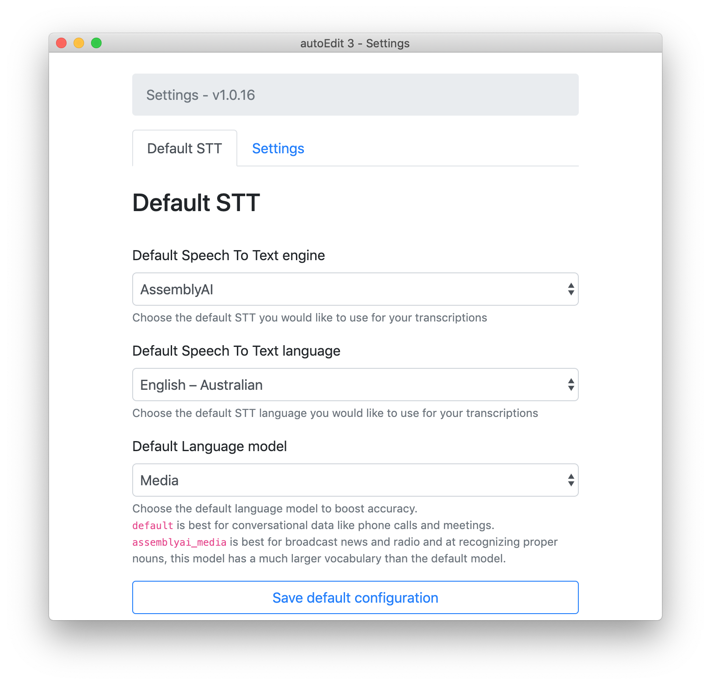

# assemblyAi

* sign up to [AssemblyAI](https://www.assemblyai.com) at [assemblyai.com/login/](https://www.assemblyai.com/login/)
* Once you have logged in /signed up. in the top left you'll see `Your API Token`
* Select and copy that string of letters and digits 
* copy and paste into the app's settings under `AssemblyAI`. 
* `Save`.

## Language preferences

Once you set your credentials as above, you also have options to choose between different English accents, and whether you'd want to use a language model or stick with the default.

[From assemblyAI's docs](https://docs.assemblyai.com/overview/custom-models)

> `default` language model Best for conversational data like phone calls and meetings.

> `Media` language model is best for broadcast news and radio and at recognizing proper nouns, this model has a much larger vocabulary than the default model.

