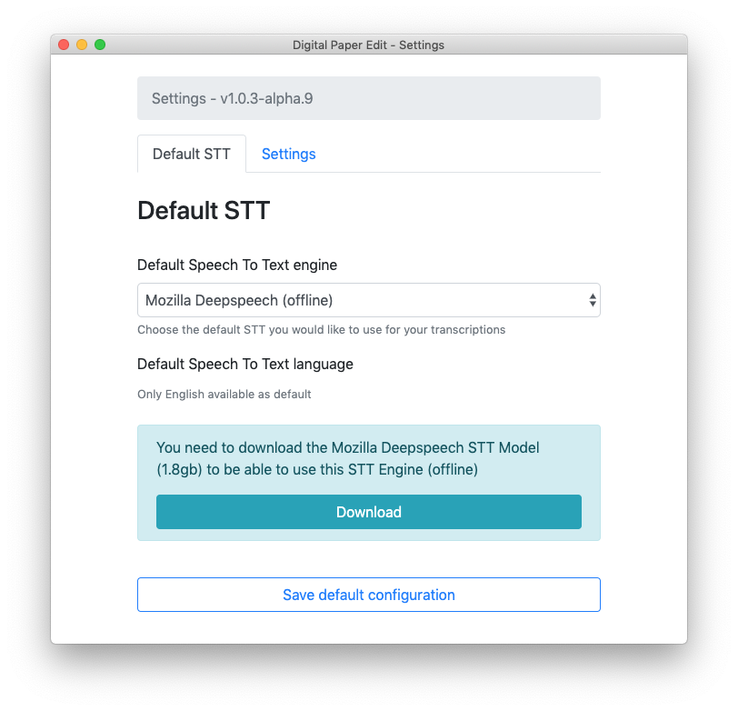
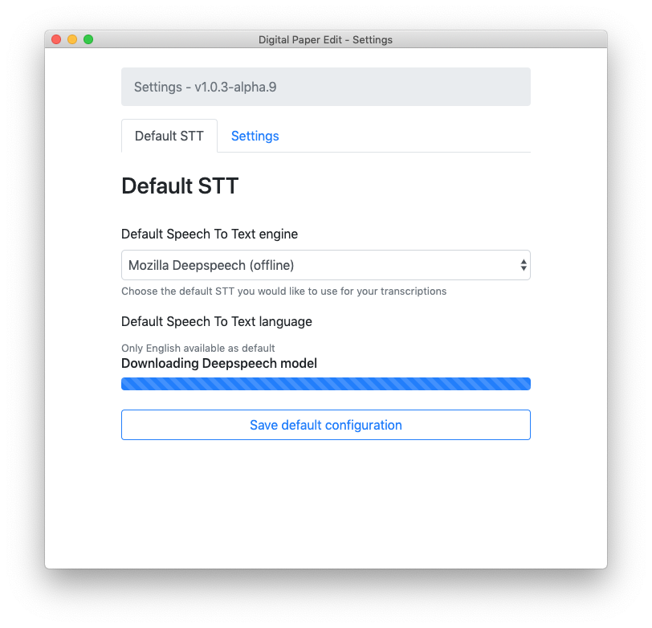
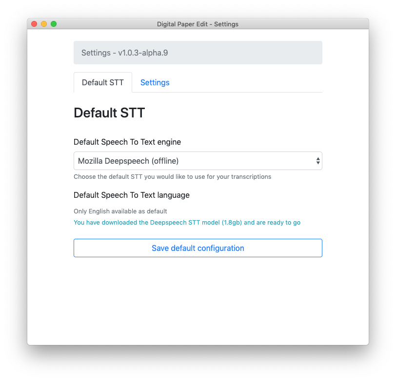

# Mozilla DeepSpeech

Follow along the [instructions in the initial setup](../setup.md)

1. Choose Mozilla Deepspeech as STT engine

2.Click on download button  


unfortunately as of this version there is no progress indication.


Once it's done downloading it will notify you with a message

> You have downloaded the Deepspeech STT model \(1.8gb\) and are ready to go

3. click `save`

