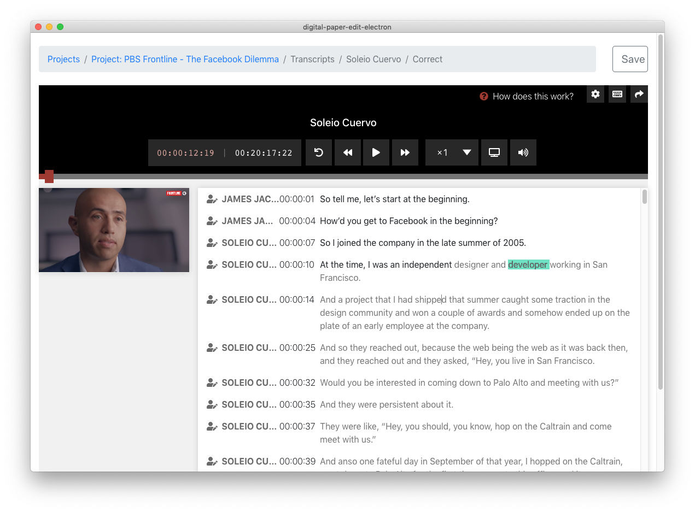

# Correct the text of a transcription

After having [created a transcription,](create-a-new-transcription/) click on the transcription to view and edit the text.


Unfortunately in the current version there is a performance issue when working with video that are over one hour. [We are looking into it.](https://github.com/bbc/react-transcript-editor/issues/150)



Note that as of this version, the transcript editor, does not auto save make sure to click the save button often as you change your work \(just in case\). As well as when you are done correcting the text.


## Key features

* Double click on a word or timestamp to jump to that point in the video.
* Start typing to edit text \(video while auto pause while you are typing and resume when you are done\).
* Press enter to split a paragraph 
* You can add and change names of speakers in your transcript. 

## Advanced features

* Change playback speed 
* Use keyboard shortcuts for quick control.
* Click settings cog wheel to 
  * Enable scroll sync to keep audio/video in sync with the text and the progress bar
  * Adjust timecode offset of the media 
  * Change the roll back value
  * Hide or show time-codes, speaker labels and video preview.
  * Disable pause while typing functionality 
* Enable picture in picture mode, by clicking on the tv icon button to make the video preview larger.


See [export options](export.md) for more details on how to export a transcript from the app, with or without time-codes in a variety o formats.


