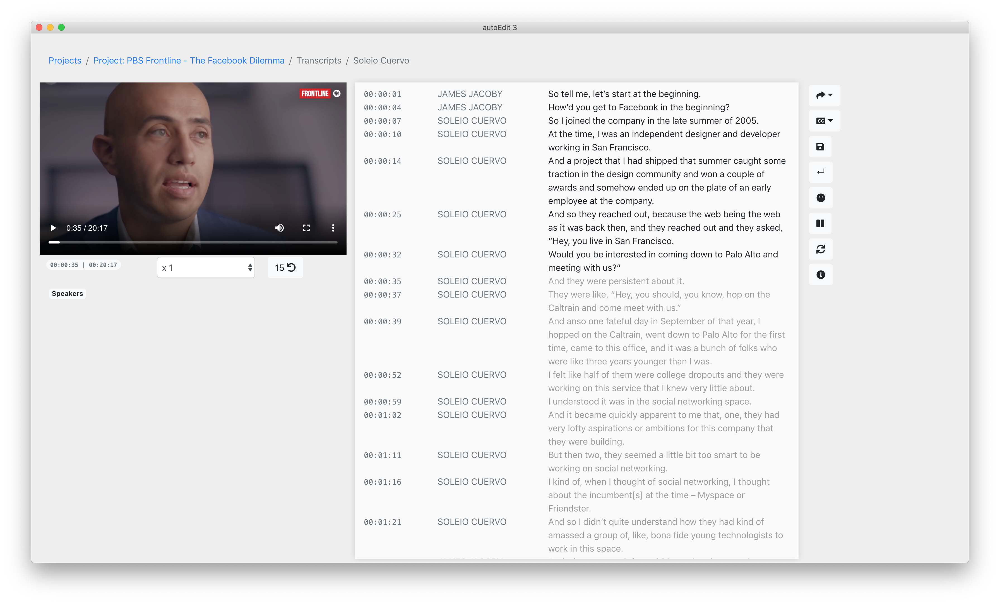

# Correct the text of a transcription

After having [created a transcription,](create-a-new-transcription/) click on the transcription to view and edit the text.


**Update**: the current version is able to handle video/audio transcriptions that are over one hour in length.



Note that as of this version, the transcript editor, does not auto save make sure to click the save button often as you change your work \(just in case\). As well as when you are done correcting the text.


## Key features

* Double click on a word or timestamp to **jump to the beginning of that paragraph** point in the video or audio.
* If turn on auto pause while typing ⏸. When you start typing to edit text video or audio will pause while  you are typing and resume when you are done.
* Press enter to split a paragraph. or the `↵` button.
* You can add and change names of speakers in your transcript. 

## Advanced features

* Change playback speed 
* Enable picture in picture mode, by clicking on the video menu option to make the video preview larger.


See [export options](export.md) for more details on how to export a transcript from the app, with or without time-codes in a variety o formats.


