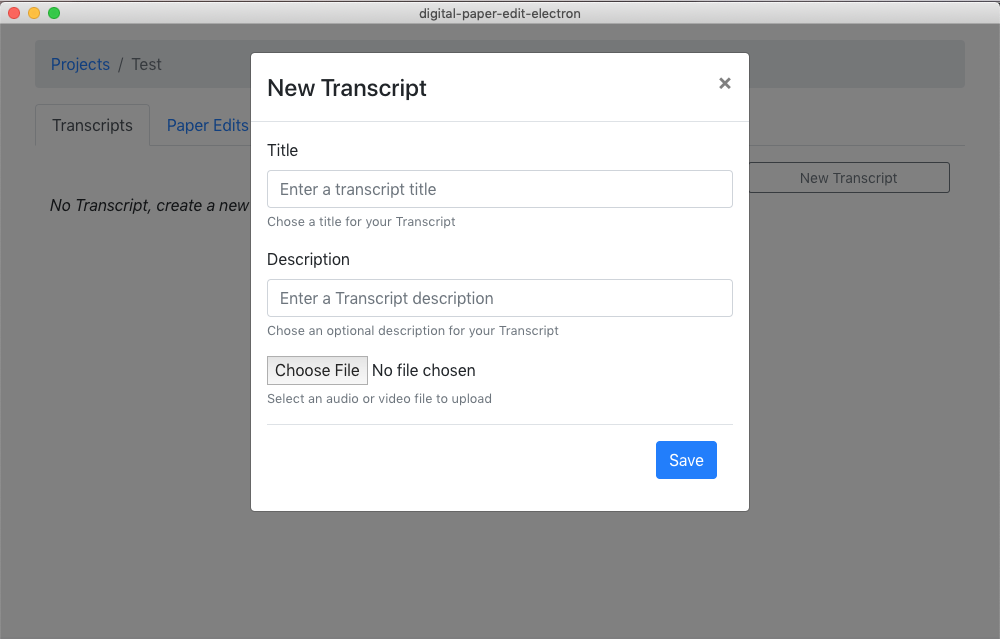
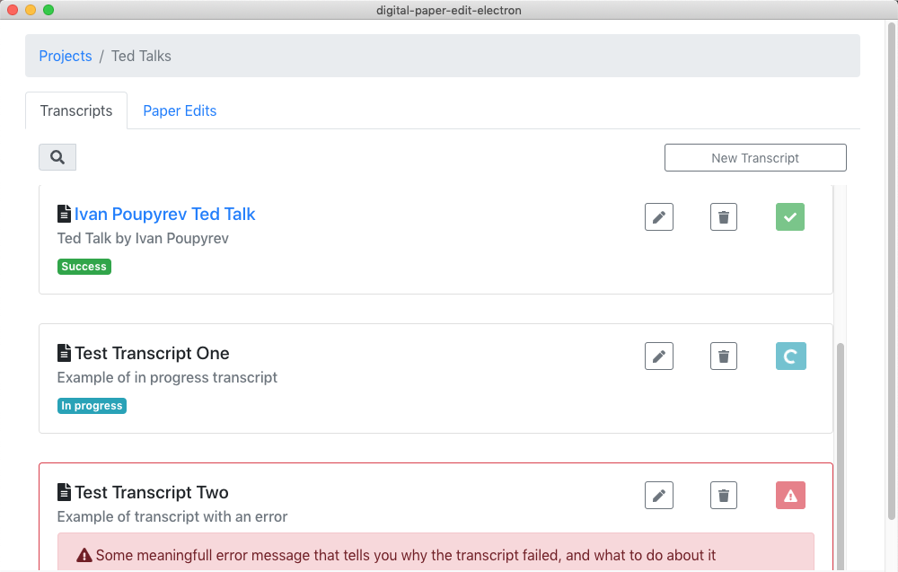

# Create a new transcription


Make sure you have gone through the [initial setup](../../setup.md). Chose a Speech To Text engine to use for your transcription. And added API credentials where appropriate.


After[ creating a project](../../projects-1/create-a-new-project.md) click on `New Transcript`

Choose a video or audio file and click `save`.


If you get an error when create a new transcription, feel free to take a screenshot of the error message and [raise an issue. See here for more detail on how to do that.](../../troubleshooting/reporting-issues.md)


