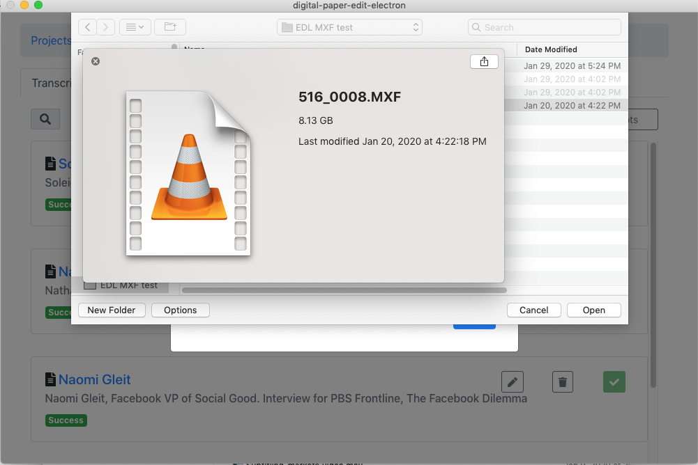

# Working with MXF files


If you are working with MXF file but not using FCPX, your mac might not be able to preview them from the finder  unless you re using VLC


You can [download the Pro Video formats 2.0.4 from Apple.](https://support.apple.com/kb/DL1396?viewlocale=en_US&locale=en_US)

But the catch is that you need either [FCPX](https://www.apple.com/final-cut-pro/) \(299$\), [Motion](https://apps.apple.com/us/app/motion/id434290957?mt=12)\(49.99$\) or [Compressor](https://apps.apple.com/us/app/compressor/id424390742?mt=12) \(49.99$\) to be able to install the Pro Video Formats.

