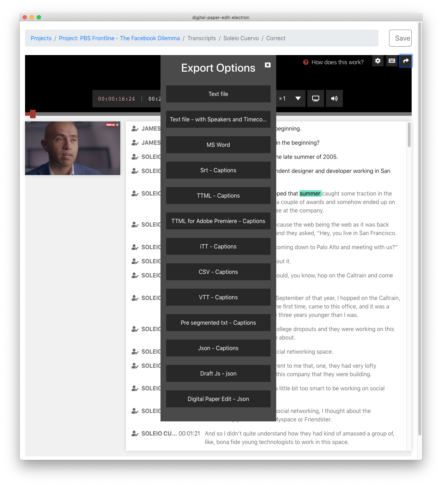

# Export options

After having [created a transcription ](create-a-new-transcription/)and \(optional\) [corrected the text](correct-the-text-of-a-transcription.md) you can click on the export icon on the top right to see a list of export options

#### Main export options

* text file
* Text file with speakers and timecodes
* Ms Word
* Srt - Captions

#### Advanced options 

* TTML - Captions
* TTML for Adobe Premiere - Captions
* iTT - Captions
* CSV - Captions
* VTT - Captions
* Pre-segmented text - Captions

#### Developer options

* Json - Captions
* Draft Js - Json 
*  Digital Paper Edit - Json

