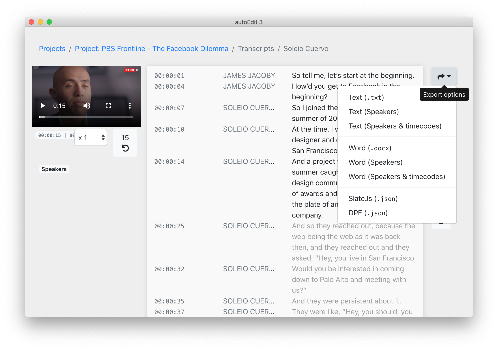

# Export options

After having [created a transcription ](create-a-new-transcription/)and \(optional\) [corrected the text](correct-the-text-of-a-transcription.md) you can click on the export icon on the top right to see a list of export options

#### Main export options

* Text file with  optional speakers and timecodes**\***
* Ms Word, `docx`
* Srt - Captions

**\***There's an option for the text file with speakers and timecodes to be in the format that is compatible with [atlas ti](https://atlasti.com/) if you need to import the transcript there for further analyses.

#### Advanced options 

* TTML - Captions
* TTML for Adobe Premiere - Captions
* iTT - Captions
* CSV - Captions
* VTT - Captions
* Pre-segmented text - Captions

#### Developer options

* Json - Captions
* SlateJS - Json 
* Digital Paper Edit - Json


If you need to export captions with a certain level of precision in the formatting of the lines. I'd recommend using this other app instead, [subtitles composer](https://pietropassarelli.gitbooks.io/subtitlecomposer-app/content/) \(mac only\).


