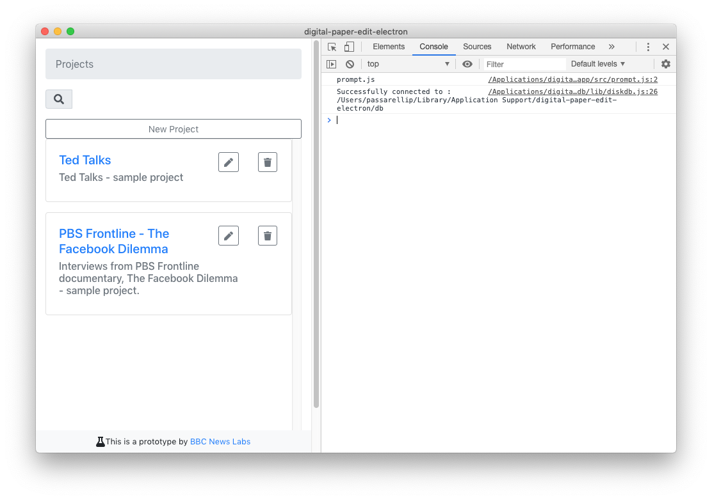

# Reporting issues

1.Click on `view` --&gt; `toggle developers tools`  \(or `⌥` + `⌘` +`i` \)  
  
2.In the new panel, click on `console`, if you are not already on it

if you see any red error message, feel free to take a screenshot. 

3.[Raise an issue](https://github.com/pietrop/digital-paper-edit-electron/issues/new?assignees=pietrop&labels=bug&template=bug_report.md&title=), and upload the screenshot alongside a description.

This will provide useful context to help narrow down the context of a problem.


Note that every time you restart the app the `console` gets wiped, and it is therefore only representative of the current "session".


